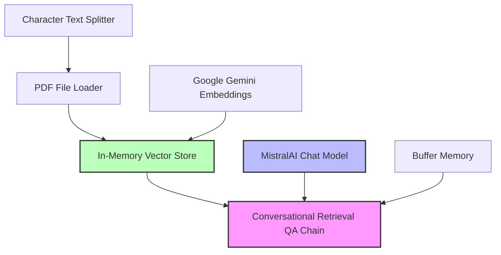

# ChartFlow Architecture: Prakash Chatflow

**GitHub Repository:** [paadhikari4-design/chartflow_git](https://github.com/paadhikari4-design/chartflow_git)

This document outlines the architecture and configuration of the **Prakash Chatflow**, a conversational retrieval system built with Flowise/LangChain.

## Workflow Overview

The chatflow is designed as a **Retrieval-Augmented Generation (RAG)** system that allows users to have conversations with PDF documents. It uses **MistralAI** for natural language generation and **Google Gemini** for creating high-quality text embeddings.

---

## Component Details

### 1. Document Processing
- **Loader**: `Pdf File` - Specifically configured to handle PDF document ingestion.
- **Text Splitter**: `Character Text Splitter`
    - **Chunk Size**: 1000 characters
    - **Chunk Overlap**: 200 characters
    - **Purpose**: Breaks down large documents into manageable segments while maintaining context through overlap.

### 2. Semantic Search & Storage
- **Embeddings**: `Google Gemini Embedding`
    - **Model**: `gemini-embedding-001`
    - **Task Type**: `RETRIEVAL_DOCUMENT`
- **Vector Store**: `In-Memory Vector Store`
    - **Function**: Temporarily stores document embeddings for fast semantic lookup during queries.

### 3. Language Model
- **Model**: `MistralAI`
    - **Version**: `mistral-tiny`
    - **Temperature**: 0.9 (Allowing for creative and fluid responses)
    - **Streaming**: Enabled

### 4. Logic & Memory
- **Chain**: `Conversational Retrieval QA Chain`
    - **Role**: Coordinates the retrieval of relevant context from the vector store and passes it to the Mistral model along with the user's question and past history.
- **Memory**: `Buffer Memory`
    - **Memory Key**: `chat_history`
    - **Function**: Maintains the state of the conversation, allowing the model to understand follow-up questions.

---

## Configuration Summary

| Feature | Setting |
| :--- | :--- |
| **Primary LLM** | Mistral Tiny |
| **Embedding Model** | Gemini Embedding 001 |
| **Storage Type** | In-Memory |
| **Splitting Strategy** | Character-based (1000/200) |
| **Chain Type** | Conversational Retrieval QA |
